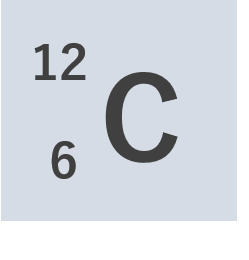
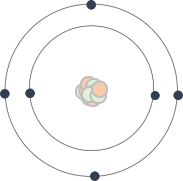
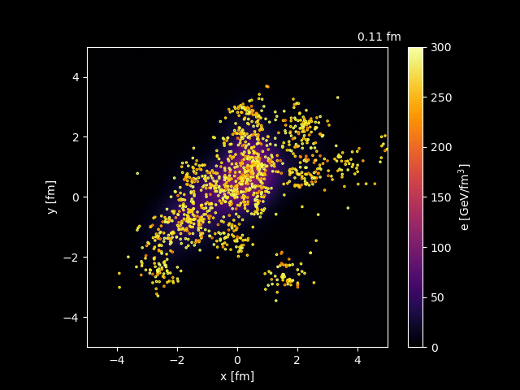
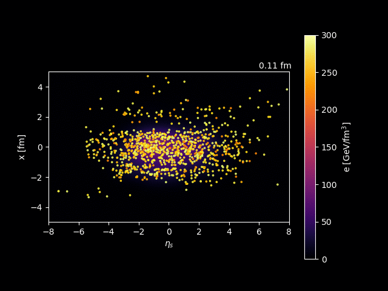

When someone asks, “What are the substances around us made of?”, what comes to your mind?
These elements, each with different properties, have a periodic nature — corresponding to their atomic numbers and electron configurations — and this regularity is beautifully represented in the periodic table, which I think we learn about in schools.

Let’s take a familiar example — carbon, an atom with atomic number 6 and mass number 12. The atomic number represents the number of protons contained in nucleus, and the mass number is the total number of protons and neutrons in nucleus.
Therefore, we can see that a carbon atom is made up of six protons and six neutrons.

I guess many people have seen this kind of illustration of an atom:
the nucleus at the center, with electrons orbiting around it, and protons and neutrons sitting inside the nucleus.

There is a warning, however — this illustration is not precise in several senses.

One important thing to keep in mind is that the nucleus is about $10^{-5} = 0.00001$ times smaller than the atom.
If an atom were the size of San Francisco (roughly 10 km across), the nucleus would be about the size of an apple (around 10 cm).

Therefore, the matter around us — including our own bodies — is far more hollow than one might imagine.

<!--

-->
