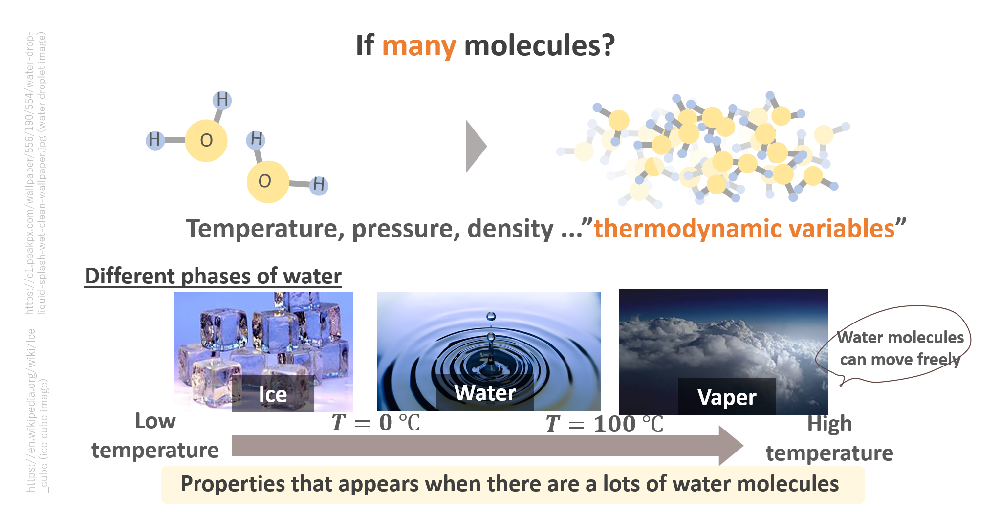
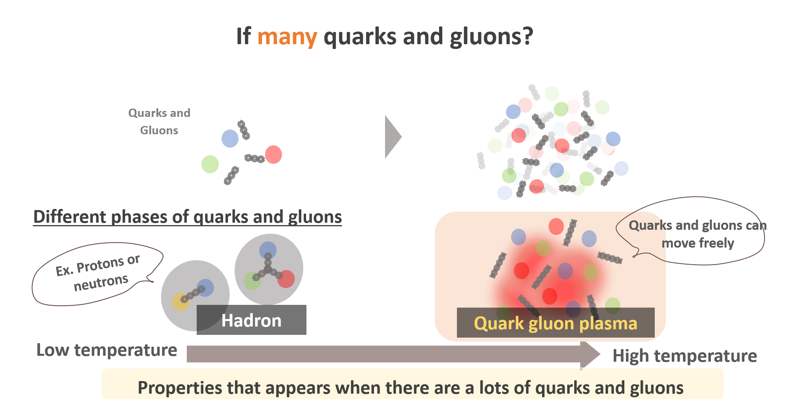

In general, we have two types of properties of matter - static property and dynamical property.
What does it mean by static properties?

Let's start from thinking about the concept of "matter".
Imagine you have a single water molecule, and there is nothing around.
You would perceive this as a single particle, and nothing interasting happens.
What if, then, you have A LOT of (the order of 10 to the power of 23) molecules?

In this kind of system, it is usually useful and practical to characterize the system with thermodynamic variables, rather than following the kinematics of individual particles.  For instance, temperature, pressure, density etc. are ones of the thermodynamic variables.

And you all know that at low temperatures below 0 celcius degree, water exists as ice, and it melts and becomes water when you heat it up. Above 100 celcius degrees, it eventually becomes vaper.
This is what we call static "properties of matter" which appears when you have a lot of molecules!

The same concept applies to quarks and gluons too. At low temperatures, quarks and gluons are confined into hadrons (protons and neutrons are one of them). Once you heat up hadrons, there will be a state where quarks and gluons can move freely at very high temperatures. This state is so called "quark-gluon plasma", and my scientific interest is to investigate its properties.

